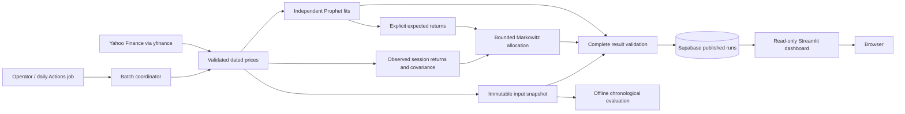

# Architecture

Status: established Milestone 0 design, with the Milestone 1 configuration and
packaging foundation implemented. Later application components remain planned. The supplied
[product](specifications/PROJECT_SPEC.md),
[behavior](specifications/BEHAVIOR_SPEC.md), and
[ML](specifications/ML_SPEC.md) specifications are authoritative. Corrections
classified in [IMPROVEMENTS.md](specifications/IMPROVEMENTS.md) take precedence
over descriptions of observed defects. Only the supplied handoff documents were
used; the original implementation was not consulted.

## Scope and system boundary

Build one Python package with two independently started workloads: a finite
forecast/allocation batch and a read-only Streamlit dashboard. Supabase is their
durable communication boundary. The batch's callable computation interface
returns a validated result without publishing it; an explicit command publishes
only after successful computation. Dashboard requests never download prices or
fit models.

The single operator configures a shared equity universe. Visitors inspect stored
recommendations, not individually saved portfolios. There are no accounts,
broker orders, live positions, cash ledger, or automatic trades. Offline paper
evaluation is research output, not a trading subsystem.

Use ordinary Python modules and explicit typed records, adding each when its
milestone needs it. Do not create empty service/repository interfaces. The
`src/portfolio_forecasting/` package currently contains immutable configuration
and publication-credential validation. Future milestones add market data/calendar
handling, forecasting, allocation, evaluation, persistence, batch, and dashboard
responsibilities. They are in-process boundaries, not services.

## Reference configuration

| Setting | Initial policy |
| --- | --- |
| Ordered universe | AMD, MSFT, AAPL, TSLA, AMZN, NVDA, META, GOOG, TSM, JPM, NFLX, PLTR |
| Historical start | 2024-01-01, inclusive |
| Historical end | Exclusive date bound, resolved at each invocation; never at import |
| Research price | Daily adjusted close, explicitly configured and labelled; USD US-listed securities |
| Session calendar | XNYS schedule for the configured US equity session universe; validate listing/calendar compatibility |
| Forecast | Independent Prophet price-level refit; next valid session |
| Components | Yearly and weekly enabled, daily disabled, known exchange-holiday effects enabled initially |
| Risk window | Latest 252 complete realised single-session return vectors |
| Expected returns | Direct fractional forecast returns initially |
| Risk aversion / bounds | 5 / common fractional lower bound 0.05 and upper bound 1.0 |
| Recent actual context | Dated observations within 30 calendar days of cutoff, inclusive |
| Dashboard cache | 300 seconds, refreshed on a subsequent access after expiry |
| Scheduled request | Daily at 09:00 UTC plus manual invocation, with market eligibility checks |

Scientific settings are nonsecret, validated, and recorded in the run. Database
credentials are read from the process environment only when publication or
retrieval is requested. Retain `SUPABASE_URL` and `SUPABASE_KEY` as the documented
connection names, with independently provisioned reader and writer credentials
in the two workloads. No implicit `.env` loading is promised. Dashboard controls
do not expose scientific settings or secrets.

## Contracts and computation

**Request and time.** A request owns the ordered unique universe, date bounds,
model/risk settings, live or retrospective mode, and explicit scientific revision.
Inject a clock for deterministic resolution. Capture timezone-aware UTC execution
time once; derive session dates and opening/closing timestamps from the exchange
calendar. Resolve an omitted exclusive end to that timestamp's date in the
exchange timezone. Keep execution time, requested end, actual observation cutoff, and
forecast target separate. A live morning run uses the latest completed session,
targets the upcoming eligible session, and must publish before its opening time.
Closed-market dates and identical already published requests are explicit no-ops.
Late or stale live requests fail; historical requests are labelled retrospective
and cannot satisfy live freshness checks. Recheck the deadline before publication.

**Data.** Specify daily interval, adjustment, repair policy, start/end semantics,
and timeout explicitly in the provider adapter. Validate requested membership,
security/currency metadata, unique ordered session dates, positive finite prices,
and freshness. Retry transient provider failures up to three attempts with bounded
backoff; malformed data fails without futile retries. A missing required asset
fails the whole run and identifies the asset. No silent exclusions or imputation.

Build the common price panel against expected exchange sessions before computing
returns. Reject missing required sessions, including mismatched intervals across
assets. Keep the first price for training; only the first return is undefined.
A 252-return production window therefore requires at least 253 consecutive
session prices. Training history must also satisfy the model's separate gate:
initially two calendar years when yearly seasonality is enabled. Shorter research
settings must be explicit, recorded, and never silently relax production gates.

Store a content-addressed, immutable snapshot of the actual dated inputs, provider
options, retrieval timestamp, currency/adjustment convention, and content hash.
Milestone 2 uses local artifacts; Milestone 4 adds private durable storage within
Supabase. Preserve original snapshots when adjusted history is subsequently
revised. Snapshotting makes the captured experiment reproducible; a newly fetched
historical series does not establish point-in-time availability in the past.

**Forecast.** Fit a fresh Prophet model for each asset using prices through the
cutoff only. Record effective component/prior, growth, changepoint, fitting, and
seed settings with package/code revisions. If holiday features are enabled,
provide known event occurrences and their windows through the forecast horizon.
Predict only the recorded target session. Reject nonpositive/nonfinite predicted
prices and nonfinite fractional returns, computed as `predicted / observed - 1`.
No fitted-model persistence, inference API, or fit concurrency is initially needed.

**Allocation.** Keep expected return `mu` separate from realised risk data. Start
with direct forecast returns and observed-only sample covariance (`ddof=1`) over
the last 252 session returns. Maximise
`mu.T @ w - (risk_aversion / 2) * w.T @ covariance @ w`, subject to full investment
and configured long-only bounds, in per-session units. Require finite positive
risk aversion and `N * lower <= 1 <= N * upper`, with `0 <= lower <= upper <= 1`.
With twelve default assets the effective largest holding is 45%; there is no cash
option even when every forecast return is negative.

Use SciPy SLSQP, explicit stopping/iteration settings, and the quadratic analytic
gradient. Check ticker alignment, finite inputs, covariance symmetry and positive
semidefiniteness within documented tolerance, and report conditioning. Independently
check the solution's finite weights, budget, bounds, and objective against a
feasible starting point. Singular positive-semidefinite covariance is not alone
an error; fail invalid or unsatisfactory solutions without silently replacing
them with equal weights. Set and test exact tolerances in Milestone 3. Do not
clip or renormalise a failed solution into an apparently valid portfolio.

## Persistence and publication

The logical data model is a run header plus owned asset results, dated actual
observations, and snapshot references. Physical SQL and migrations belong to
Milestone 4, not this planning milestone.

| Record | Required information |
| --- | --- |
| Run | Shared ID, stable logical request key, explicit revision, mode, UTC execution/publication times, cutoff/target, ordered universe, effective settings, software/lock/data hashes, publication state, diagnostics |
| Asset result | Run ID/ticker, observed cutoff price, target forecast price, fractional forecast return, fractional allocation, dated recent actual history |
| Input snapshot | Immutable dated input and retrieval manifest, hash, durable location, adjustment/currency identity |
| Outcome | Ticker, exact target session, actual price, retrieval/revision/basis metadata, association status |

Derive the logical request key from mode, cutoff/target, canonical universe,
effective scientific settings, software revision, and explicit scientific revision;
exclude the attempt's wall-clock timestamp. The first durable request record binds
the snapshot hash. A retry reuses that snapshot and identity. A changed dataset or
configuration cannot silently overwrite it; an intentional recomputation requires
a distinct scientific identity/revision. Concurrent attempts resolve through a
database uniqueness constraint, not only a workflow lock.

Register an unpublished attempt and snapshot binding, then use a transactional
database operation to validate and commit the full set of asset results and
published status together. Validate membership, dates, numeric fields, budget, and
bounds at the application boundary and enforce durable invariants in SQL. Reject
missing values instead of substituting zero. A repeated successful publication
returns the existing coherent result; conflicting payloads fail. A failed attempt
does not displace the previous published portfolio. Read back and verify the
published membership before reporting CLI success.

The dashboard reads only published runs. Separate reader/writer permissions,
versioned migrations, restricted publication function permissions, and real
database tests must enforce this contract. Keep administrative credentials away
from dashboard processes and browser output.

Associate outcomes only with the exact ticker and forecast target, using a
comparable adjusted-price basis and retaining revision provenance. Missing or
incompatible outcomes remain explicitly pending/unavailable; never substitute the
next stored run or silently rewrite an old forecast. Batch retrieval can collect
missing matured target observations across skipped jobs; it must not backdate
newly issued forecasts. Define and test corporate-action basis reconciliation
before reporting live errors in Milestone 4.

## Dashboard and evaluation

Query run summaries with stable pagination; fetch the selected run completely and
check its membership before plotting. Page ticker outcome history independently
and state its actual coverage. Select the latest completed run by default, with
deterministic revision ordering. A date with multiple deliberate revisions offers
coherent run choices; never merge per-ticker rows from separate attempts.

Preserve the date/ticker selectors, allocation doughnut, numeric weight column,
forecast-price/percentage-return table, latest stored actual/prediction metrics,
interactive actual-versus-predicted chart with vertical-range control, and
individual error table. Format adjusted USD prices to two decimals and fractional
returns/weights as percentages. Use actual session dates. Display cutoff, target,
freshness, and the fact that historical performance covers all available history
for the chosen ticker even when an older run is selected. Cache expiry is not a
background refresh promise.

Distinguish no published runs, pending outcomes, invalid records, and unavailable
storage. A first populated run still renders forecasts and allocation. Validate
chart ranges, degenerate series, finite values, and complete weights before
rendering. Display signed price error as `actual - predicted`, absolute error, and
percentage error as `100 * (actual - predicted) / predicted`, clearly labelling
the denominator. Do not call this percentage MAPE.

Offline evaluation uses frozen inputs and recorded chronological train,
validation, and final test periods. At each origin, fit every learned quantity
using only data available through its cutoff, produce predictions/weights, and
only then access the target outcome. Keep final test data out of parameter,
window, blend, covariance, and constraint selection. Known future calendar events
are allowed features; future prices are not. Record exclusions and acknowledge
fixed-universe selection bias and retrospective adjusted-data revisions.

Compare identical asset/session pairs against last-price forecasts; compare
allocations against equal weights and historical-only expectations under comparable
constraints. Report per-asset price MAE/RMSE, return MAE, directional accuracy with
a declared tie policy, baseline-relative error, and sample counts. Test bounded
Prophet variations, optional shrinkage, forecast/prior blends, and bound/risk
sensitivity on validation data; retain simpler methods unless evidence supports
a change. No accuracy or profitability claims precede measurement.

If reporting executable paper performance, weights issued before a target close
can first earn the target-close-to-following-close interval. State the signal lag,
price/execution convention, drifted pre-trade holdings, turnover, costs, slippage,
and risk-free assumption. Report gross/net returns, volatility, drawdown, turnover,
and concentration separately from forecast-origin diagnostics. Resolve execution
price and corporate-action accounting requirements before calling results
executable; adjusted research closes alone are not raw trade prices.

## Reproduction, quality, and operation

Use one supported and tested Python minor, `uv` with a committed independent lock,
pytest, Ruff formatting/linting, and mypy. Milestone 1 verifies Python 3.12.14, uv/uv_build 0.12.13, tzdata 2026.4,
pytest 9.1.1, Ruff 0.16.7, and mypy 2.3.1 on Linux x86-64. The runtime
currently needs only tzdata; its pinned database supplies New York timezone rules. Add dependencies as features need them:
NumPy/pandas/SciPy, Prophet, an exchange calendar library, yfinance, Supabase,
Streamlit, and one charting library. Optional research packages require an actual
experiment. Build and install the package in a clean environment as part of the
foundation checks, then repeat with the native model backend when introduced.

Use GitHub Actions for the single read-only quality gate and, later, batch and
release workflows. Tests use deterministic offline market fixtures plus small
real model, disposable-database, and UI integration checks as those features land.
Live provider checks are explicit opt-in checks. Scientific assertions declare
numeric tolerances; lockfiles do not promise bitwise equality across native CPUs.

Deploy the exact passing revision to a modest VPS as a non-root systemd service
in a locked virtual environment behind an HTTPS reverse proxy. Independently
document provisioning, environment injection, restricted deployment access,
verified SSH host keys, immutable workflow action pins, serialised release,
readiness/result-read checks, and rollback to the previous release. Keep scheduler
execution tied to a recorded known release. No Docker or second CI provider is
needed initially; the maintenance rationale is in [DECISIONS.md](DECISIONS.md).

Bound job time and transient retries, correlate logs with run IDs, record stage
durations/data counts/solver residuals, and distinguish success, no-op, and failure.
Monitor the last expected eligible published session, not just web process uptime.
Document missed-run recovery, retention, and backup/restore; demonstrate actual
prospective sessions and a matured outcome before claiming operational completion.

## Review and remaining gates

[SPECIFICATION_COVERAGE.md](SPECIFICATION_COVERAGE.md) maps the proposed design to
the product behaviors, all required corrections, and acceptance checks. Coverage
means an assigned design and verification path, not completed functionality.
[IMPLEMENTATION_PLAN.md](IMPLEMENTATION_PLAN.md) retains the supplied Milestones
1–6 after this preparatory Milestone 0. External service provisioning, provider
display entitlement, future scientific/native dependency compatibility, empirical
ML choices, numerical tolerances, and live deployment evidence remain future gates.
See [configuration contracts](docs/CONFIGURATION.md) and the
[Milestone 1 report](MILESTONE_1_REPORT.md) for the implemented boundary and checks.
