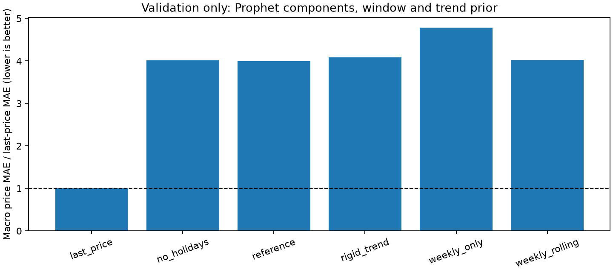
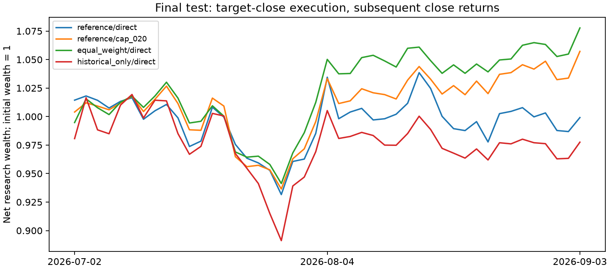

# Milestone 3 model-selection evidence

Retrospective adjusted-close research on a fixed twelve-asset universe. These are not executable trading returns or evidence of investment alpha.

Frozen input: `de59a36d380db0db6d78b1c4d0771d7bea18dc5bc6a3934d869b994375c6d1d0`.
Full local result: `25a4b77488561402cae47259b8368d30b9ce3078b47b72c15924e28a80d0391a`.
Selection locked before final testing: `2c65b0fd7de0a09e9063eded04f50b5ec3466adfa3530b2b87c053a419becc23`.

Validation selected **reference/cap_020**. The unchanged **reference/direct** remains a reported comparator and the callable product default.

| Phase | Model | Origins | Price MAE / last-price MAE |
| --- | --- | ---: | ---: |
| validation | last_price | 17 | 1.000000 |
| validation | no_holidays | 17 | 4.011555 |
| validation | reference | 17 | 3.997361 |
| validation | rigid_trend | 17 | 4.088377 |
| validation | weekly_only | 17 | 4.785510 |
| validation | weekly_rolling | 17 | 4.020929 |
| final_test | last_price | 9 | 1.000000 |
| final_test | reference | 9 | 2.599968 |

A ratio above 1 means worse price MAE than last price. Dollar errors are reported per asset in the CSV, never pooled.

| Phase | Policy | Gross return | Net return | L1 turnover | Mean HHI |
| --- | --- | ---: | ---: | ---: | ---: |
| validation | reference/direct | 5.2326% | 4.3687% | 5.4926 | 0.2262 |
| validation | reference/cap_020 | 12.9981% | 11.8076% | 7.0589 | 0.1251 |
| validation | equal_weight/direct | 12.8661% | 12.7667% | 0.5871 | 0.0834 |
| validation | historical_only/direct | 36.0336% | 35.3536% | 3.3397 | 0.1733 |
| final_test | reference/direct | 0.5357% | -0.0881% | 4.1467 | 0.2285 |
| final_test | reference/cap_020 | 6.2554% | 5.7162% | 3.3906 | 0.1251 |
| final_test | equal_weight/direct | 7.8235% | 7.7733% | 0.3105 | 0.0834 |
| final_test | historical_only/direct | -2.0055% | -2.2475% | 1.6479 | 0.1596 |

Costs: 10 bps transaction cost + 5 bps slippage per dollar traded. Initial holdings are equal weight, the first rebalance is charged, and terminal liquidation is excluded. Sharpe uses an explicit zero risk-free rate; volatility uses 252 sessions and sample variance.

[Per-asset errors](forecast_metrics.csv), [all allocation comparisons](allocation_metrics.csv), [numerical diagnostics and 1 bp sensitivity](solver_diagnostics.csv), [settings, counts, provenance and structured summary](summary.json).

The experiment fixes candidate order, selection thresholds, split dates and costs before evaluation. Five-session origin spacing limits fitting cost; holdings drift across every intervening session. Earlier test observations may enter later test-origin fits, but test scores cannot change the locked selection. Any failed origin is excluded for all candidates and baselines; existing holdings carry.

Provider history and the calendar are ex-post snapshots. Point-in-time price availability and executable adjusted closes are unproven. The short final test and fixed current universe limit generalization. No final-test-driven tuning or production-default promotion is made.
